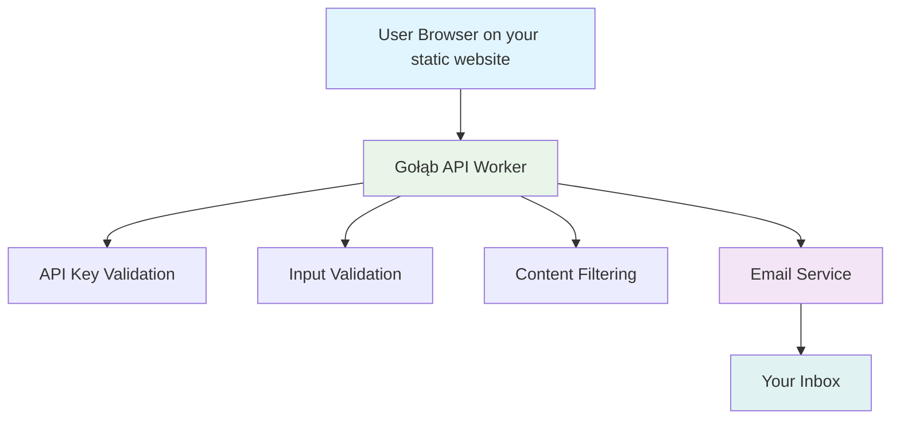
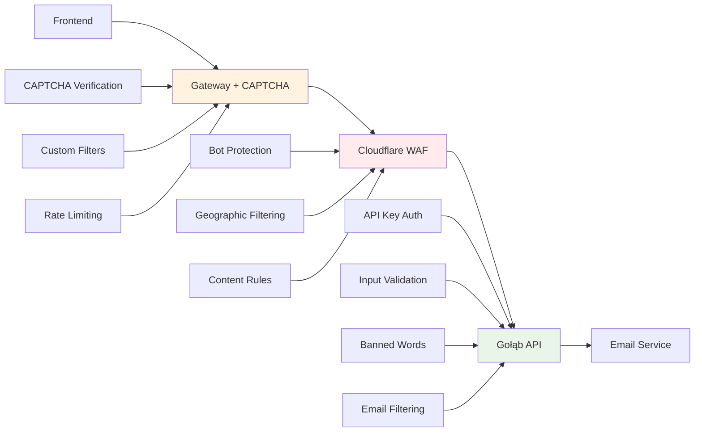

<div align="center">
    
# 🕊️ Gołąb - Secure Contact Form API
    
[](LICENSE)
[](https://www.typescriptlang.org/)
[](https://workers.cloudflare.com/)
[](https://hono.dev/)
[](https://developers.cloudflare.com/workers/platform/limits/)
[](https://www.cloudflare.com/waf/)

**A reliable, secure, and fast contact form API service built for static websites**

*"Gołąb" ("Gołąb pocztowy" to be more precise) (Polish for carrier pigeon)*

*delivers your contact form messages straight to your inbox quickly and securely*

[🚀 Quick Start](#-quick-start) • [🔒 Security](#-security-architecture) • [📖 API Docs](#-api-documentation) • [🛡️ Deployment](#-secure-deployment)

</div>

---

## ✨ Key Features

- **🚀 Lightning Fast** - Built with Hono on Cloudflare's global edge network
- **🔒 Secure** - API key, content filtering and optional WAF
- **📧 Reliable Delivery** - Powered by Resend API, optional auto-reply support
- **⚡ Optimized Bundle** - <1MB bundle size compliant with Cloudflare Workers limits
- **🌍 Global Edge** - Runs on Cloudflare's worldwide network for minimal latency
- **🔑 Flexible Auth** - Optional API key authentication
- **📱 CORS Ready** - Works seamlessly with any frontend framework

## 🏗️ Architecture Overview



## 🔒 Security Architecture

A **multi-layered security approach** that the creator strongly recommends:

### Recommended Security Stack



### 🛡️ Gateway Layer (Highly Recommended)

The creator recommends implementing a **gateway layer** between your static website and the Gołąb API:

- **Hidden API Key**: Gateway stores the secure API key, never exposed to frontend
- **CAPTCHA Integration**: Verify human users before API calls
- **Additional Filtering**: Custom business logic and validation
- **Rate Limiting**: Extra protection from spam
- **Honeypot** - Additional form fields on the frontend, which when sent to the gateway are not passed to Gołąb api (bot protection)

## 🚀 Quick Start

### Prerequisites

- [Cloudflare account](https://dash.cloudflare.com/sign-up) (free tier works)
- [Resend account](https://resend.com) for email delivery
- [Bun](https://bun.sh) or Node.js for development

### 1. Clone and Install

```bash
git clone https://github.com/Hukasx0/golab
cd golab
bun install  # or npm install
```

### 2. Environment Configuration

All environment variables are managed through Cloudflare Workers secrets for security:

```bash
# Required: Email configuration
wrangler secret put TARGET_EMAIL
# Enter: your-email@example.com

wrangler secret put FROM_EMAIL  
# Enter: "Your Name <noreply@yourdomain.com>"

wrangler secret put RESEND_API_KEY
# Enter: re_xxxxxxxxxx (from https://resend.com)

# Recommended: API key for security
wrangler secret put API_KEY
# Enter: $(openssl rand -base64 32)
```

You can also use wrangler after `bun install` like this `bun run wrangler <arguments>` (If you are in the project folder of course)

### 3. Configure CORS

Edit [`wrangler.toml`](wrangler.toml):

```toml
[vars]
# Production: Specify exact domains
ALLOWED_ORIGINS = "https://yourdomain.com,https://www.yourdomain.com"

# Development: Allow all origins
# ALLOWED_ORIGINS = "*"
```

### 4. Deploy to Cloudflare Workers

```bash
# Deploy to production
bun run deploy

# Deploy to development environment  
bun run deploy:dev
```

### 5. Configure WAF Protection (Optional, but Recommended)

In your Cloudflare dashboard (**Security** → **WAF** → **Custom Rules**):

```javascript
// Essential: Rate limiting
(http.request.uri.path eq "/api/contact" and http.request.method eq "POST")
// Action: Block after 5 requests per minute per IP

// Recommended: Bot protection  
(http.request.uri.path eq "/api/contact" and cf.bot_management.score lt 30)
// Action: Block
```

## 📖 API Documentation

### Endpoint

```
POST /api/contact
```

### Request Format

```json
{
  "email": "user@example.com",
  "subject": "Contact Form Submission", 
  "message": "Your message here (minimum 10 characters)"
}
```

### Headers (X-API-Key only when API key is enabled)

```
Content-Type: application/json
X-API-Key: your-secure-api-key-here
```

### Response Format

**Success (200)**:
```json
{
  "success": true,
  "message": "Your message has been sent successfully!",
  "timestamp": "2025-01-01T12:00:00.000Z"
}
```

**Error (400/401/500)**:
```json
{
  "error": "Validation failed",
  "details": [
    {
      "field": "email",
      "message": "Please provide a valid email address"
    }
  ],
  "timestamp": "2025-01-01T12:00:00.000Z"
}
```

### Validation Rules

| Field | Requirements |
|-------|-------------|
| `email` | Valid email format, max 320 characters |
| `subject` | Required, max 200 characters |
| `message` | Required, 10-5000 characters |

## 🔧 Environment Variables

Complete reference for all configuration options:

| Variable | Description | Required | Example |
|----------|-------------|----------|---------|
| `TARGET_EMAIL` | Where contact messages are sent | ✅ | `yourmail@yourdomain.com` |
| `FROM_EMAIL` | Sender address (must match verified domain) | ✅ | `"Contact Form <noreply@yourdomain.com>"` |
| `RESEND_API_KEY` | Resend service API key | ✅ | `re_xxxxxxxxxx` |
| `ALLOWED_ORIGINS` | CORS allowed origins (comma-separated) | ❌ | `https://yourdomain.com,https://www.yourdomain.com` |
| `API_KEY` | Secure API key for authentication | ❌ | `$(openssl rand -base64 32)` |
| `ENABLE_AUTO_REPLY` | Send thank you emails to senders | ❌ | `true` |
| `BANNED_WORDS` | Content filter (semicolon-separated) | ❌ | `spam;casino;lottery` |
| `EMAIL_DOMAIN_WHITELIST` | Allowed email domains only | ❌ | `yourdomain.com;trusted.org` |
| `EMAIL_DOMAIN_BLACKLIST` | Blocked email domains | ❌ | `spam.com;malicious.net` |
| `EMAIL_ADDRESS_BLACKLIST` | Blocked specific email addresses | ❌ | `spammer@example.com;bad@domain.com` |

### Setting Environment Variables

```bash
# Secure method (recommended for production)
wrangler secret put VARIABLE_NAME

# Development method (wrangler.toml)
[vars]
VARIABLE_NAME = "value"
```

## 🛠️ Available Commands

| Command | Description | Usage |
|---------|-------------|-------|
| `bun run dev` | Start development server | Local testing at http://localhost:3000 |
| `bun run build` | Build for local testing | Creates optimized bundle |
| `bun run build:worker` | Build for Cloudflare Workers | **<1MB bundle** for deployment |
| `bun run test` | Run test suite | Validates functionality |
| `bun run test:watch` | Run tests in watch mode | Development testing |
| `bun run test:coverage` | Run tests with coverage | Quality assurance |
| `bun run deploy` | Deploy to production | Live deployment |
| `bun run deploy:dev` | Deploy to development | Testing environment |

### Bundle Size Optimization

The project maintains a **<1MB bundle size** to comply with [Cloudflare Workers limits](https://developers.cloudflare.com/workers/platform/limits/):

(I think they recently increased it to 3mb, but I wrote it when it was 1mb, the API is not heavy either, so I stick to the max 1mb optimized bundle size rule)

- **Optimized build process** using `bun build` with browser target
- **Tree-shaking** removes unused code automatically  
- **Minification** reduces bundle size in production
- **Type-safe templates** with optimized template literals
- **Efficient dependencies** - only essential packages included

## 🌐 Frontend Integration

### Basic HTML Example

```html
<form id="contactForm">
    <input type="email" name="email" required>
    <input type="text" name="subject" required>
    <textarea name="message" required minlength="10"></textarea>
    <button type="submit">Send Message</button>
</form>

<script>
document.getElementById('contactForm').addEventListener('submit', async (e) => {
    e.preventDefault();
    
    const formData = new FormData(e.target);
    const data = {
        email: formData.get('email'),
        subject: formData.get('subject'),
        message: formData.get('message')
    };

    try {
        const response = await fetch('https://your-api.workers.dev/api/contact', {
            method: 'POST',
            headers: {
                'Content-Type': 'application/json',
                'X-API-Key': 'your-api-key-here' // If API key is enabled
            },
            body: JSON.stringify(data)
        });

        const result = await response.json();
        
        if (result.success) {
            alert('Message sent successfully! 🕊️');
            e.target.reset();
        } else {
            alert('Error: ' + result.error);
        }
    } catch (error) {
        alert('Network error. Please try again.');
    }
});
</script>
```

### React Example

```tsx
import React, { useState } from 'react';

const ContactForm = () => {
    const [formData, setFormData] = useState({
        email: '', subject: '', message: ''
    });
    const [isLoading, setIsLoading] = useState(false);

    const handleSubmit = async (e: React.FormEvent) => {
        e.preventDefault();
        setIsLoading(true);

        try {
            const response = await fetch('https://your-api.workers.dev/api/contact', {
                method: 'POST',
                headers: {
                    'Content-Type': 'application/json',
                    'X-API-Key': process.env.REACT_APP_GOLAB_API_KEY // If enabled
                },
                body: JSON.stringify(formData)
            });

            const result = await response.json();
            
            if (result.success) {
                alert('Message sent successfully! 🕊️');
                setFormData({ email: '', subject: '', message: '' });
            } else {
                alert('Error: ' + result.error);
            }
        } catch (error) {
            alert('Network error. Please try again.');
        } finally {
            setIsLoading(false);
        }
    };

    return (
        <form onSubmit={handleSubmit}>
            <input
                type="email"
                value={formData.email}
                onChange={(e) => setFormData({...formData, email: e.target.value})}
                required
            />
            <input
                type="text"
                value={formData.subject}
                onChange={(e) => setFormData({...formData, subject: e.target.value})}
                required
            />
            <textarea
                value={formData.message}
                onChange={(e) => setFormData({...formData, message: e.target.value})}
                required
                minLength={10}
            />
            <button type="submit" disabled={isLoading}>
                {isLoading ? 'Sending...' : 'Send Message 🕊️'}
            </button>
        </form>
    );
};

export default ContactForm;
```

## 🛡️ Secure Deployment

### Quick Security Checklist

- [ ] **WAF Rules Configured** (rate limiting, bot protection)
- [ ] **API Key Generated** (`openssl rand -base64 32`)
- [ ] **CORS Configured** (specific domains, no wildcards in production)
- [ ] **Gateway Implemented** (CAPTCHA + hidden API key + optional honeypot)
- [ ] **Content Filtering** (banned words, email filtering)
- [ ] **Monitoring Setup** (Cloudflare analytics, alerts)

## 🧪 Development & Testing

### Local Development

```bash
# Start development server
bun run dev

# Test the API locally
curl -X POST http://localhost:8787/api/contact \
  -H "Content-Type: application/json" \
  -H "X-API-Key: your-api-key" \
  -d '{
    "email": "test@example.com",
    "subject": "Test Subject", 
    "message": "This is a test message with enough characters."
  }'
```

### Running Tests

```bash
# Run all tests
bun test

# Run with coverage
bun test --coverage

# Watch mode for development
bun test --watch
```

## 📁 Project Structure

```
golab/
├── src/
│   ├── index.ts              # Main Hono application
│   ├── handlers/
│   │   └── contact.ts        # Contact form handler
│   ├── services/
│   │   └── email.ts          # Email service (Resend)
│   ├── utils/
│   │   ├── validation.ts     # Input validation & security
│   │   └── cors.ts           # CORS utilities
│   └── types/
│       └── index.ts          # TypeScript definitions
├── templates/
│   ├── email-template.ts     # Type-safe email templates
│   └── auto-reply-template.ts # Auto-reply templates
├── tests/                    # Comprehensive test suite
├── examples/                 # Frontend integration examples
├── package.json              # Dependencies & scripts
├── wrangler.toml            # Cloudflare Workers config
└── tsconfig.json            # TypeScript configuration
```

## 🔒 Security Features (with recommendations)

- **🛡️ Multi-layer Protection**: WAF + API + Content filtering
- **🔑 API Key Authentication**: Optional secure access control
- **🚫 Content Filtering**: Banned words and email domain filtering
- **🤖 Bot Protection**: Cloudflare's advanced bot management
- **🌍 Geographic Filtering**: Optional country-based restrictions
- **⚡ Rate Limiting**: Configurable request limits per IP
- **🔒 Input Validation**: Zod schema validation with sanitization
- **📧 Email Security**: Reply-to headers for safe communication

## 📧 Email Features

- **📬 Reliable Delivery**: Powered by Resend API (Your emails are not going to end up in spam)
- **🔄 Auto-Reply**: Optional thank you emails to senders
- **🎨 Beautiful Templates**: Type-safe HTML and text templates
- **📍 Source Tracking**: Automatic domain and timestamp logging
- **🛡️ XSS Protection**: Content sanitization for email safety

## 🤝 Contributing

1. Fork the repository
2. Create a feature branch (`git checkout -b feat/amazing-feature`)
3. Commit your changes (`git commit -m 'Add amazing feature'`)
4. Push to the branch (`git push origin feat/amazing-feature`)
5. Open a Pull Request

## 📄 License

This project is licensed under the **AGPL-3.0 License** - see the [LICENSE](LICENSE) file for details.

---

<div align="center">

**🕊️ Gołąb - Your reliable carrier pigeon for contact forms**

*Made for developers who need secure, fast, and reliable contact form APIs for their static websites*

</div>
